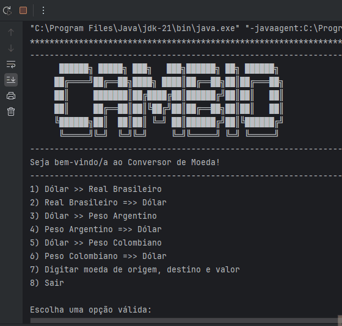
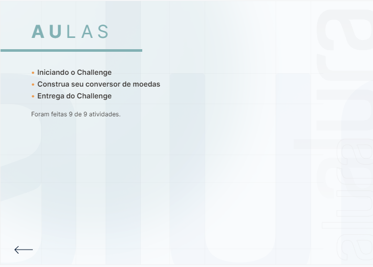

# Alura - ONE Oracle Next Education T6
# Challenge ONE: Conversor de Moedas

Este repositório apresenta o desafio do Conversor de Moedas, uma oportunidade emocionante para os iniciantes em back-end Java praticarem suas habilidades. O projeto visa construir uma ferramenta interativa via console, utilizando APIs para obter taxas de câmbio em tempo real e realizar conversões entre diferentes moedas.
Ao longo do desafio, os participantes serão guiados através dos requisitos, configuração do ambiente, integração com a API Extended Rate e quebra do projeto em tarefas gerenciáveis no Trello. O objetivo final é criar um programa que ofereça no mínimo seis opções de conversão de moedas, interaja com o usuário, obtenha as taxas de câmbio dinamicamente e forneça o valor final convertido.
A documentação detalhada no repositório orienta os participantes em cada etapa do processo, desde a configuração inicial até a conclusão do desafio. A colaboração e a comunicação são incentivadas, com suporte disponível no Discord para esclarecimento de dúvidas.
Este desafio não apenas fortalece as habilidades técnicas em Java e integração com APIs, mas também promove a prática autônoma e a resolução de problemas, habilidades essenciais para o desenvolvimento de software.

#OracleNextEducation #Alura #DesafioONE #Java #API #ConversorDeMoedas

## Índice

- [Instrutora](#instrutora)
- [Apresentação](#apresentacao)
- [Configuração do Ambiente Java](#configuracao)
- [Integração de APIs](#integração-de-apis)
- [Consumo da API](#consumo)
- [Análise da Resposta JSON](#analise)
- [Filtro de Moedas](#filtro)
- [Exibição de Resultados aos Usuários](#exibicao)
- [Conclusão](#conclusao)
- [Badge e Certificados](#badge-certificados)
- [Licença](#licença)

## <a name="instrutora"> Instrutora </a>

[Maria Fernanda](https://www.linkedin.com/in/maria-fernanda-ferreira-/) - Instrutora Alura e Oracle Next Education - Cientista da Computação pelo Centro Universitário do Triângulo, Estagiário de TI no Santander e pesquisador em meu tempo livre sobre temas como Tecnologia de Código Aberto, Bancos de Dados, Inteligência Artificial, Computação em Nuvem, Arquitetura de Software e Redes.

## <a name="apresentacao"> Apresentação </a>

Durante o curso, desenvolvi um Conversor de Moedas em Java, uma experiência que ampliou minhas habilidades de programação. O projeto consistiu na criação de uma aplicação interativa via console, utilizando APIs para obter taxas de câmbio em tempo real e realizar conversões entre diferentes moedas.

## <a name="configuracao"> Configuração do Ambiente Java </a>

Para o Desafio do Conversor de Moedas, configurei o ambiente de desenvolvimento Java. Garanti a presença do Java JDK, versão 11 ou superior, a instalação da biblioteca Gson, utilização do Postman para testes de APIs e o IntelliJ IDEA como minha IDE opcional.

Foi crucial entender a API de taxas de câmbio, revisar sua documentação e obter a chave necessária para acesso aos dados. Segui as instruções da API para preparar as solicitações e obter informações atualizadas.

A importação da biblioteca Gson no IntelliJ seguiu os passos do curso. Configurei-a no projeto e a utilizei nos arquivos Java.

Essas etapas foram essenciais para o sucesso do projeto, proporcionando um ambiente de trabalho adequado e conhecimento sobre como acessar e manipular os dados da API.

  <a href="#topo" style="text-decoration: none; background-color: #007bff; color: white; padding: 10px 20px; border-radius: 5px;">Voltar ao Topo</a>

## <a name="integração-de-apis">  Integração de APIs </a>

A construção do cliente para solicitações à API de taxas de câmbio foi realizada utilizando a classe HttpClient em Java fornecida pelo site da API. Esta classe simplifica a conexão e a obtenção de respostas, fornecendo uma base sólida para operações HTTP estruturadas e versáteis. Explorar o HttpClient otimizou o processo de solicitação de dados.

Além disso, a construção da requisição com a classe HttpRequest permitiu configurar e personalizar as solicitações de acordo com as necessidades específicas do projeto.

A interface HttpResponse foi fundamental para gerenciar as respostas da API, permitindo acesso e análise de diferentes elementos, como códigos de status, cabeçalhos e corpo da resposta, geralmente em formato JSON.

> [!NOTE]
> Classes: [Conversor](cambio-moeda/src/Conversor.java)
>     Esta classe é responsável por realizar a conversão de moedas. Ela faz uma solicitação HTTP para a API do ExchangeRate e usa a resposta para calcular o valor convertido.
> Métodos:  converterMoeda(String moedaOrigem, String moedaDestino, Scanner scanner): Este método recebe a moeda de origem, a moeda de destino e um objeto Scanner como parâmetros. Ele faz uma solicitação HTTP para a API do ExchangeRate, obtém a taxa de câmbio mais recente e calcula o valor convertido.

Essas práticas fortaleceram as habilidades de desenvolvimento e prepararam para desafios semelhantes em projetos futuros.

  <a href="#topo" style="text-decoration: none; background-color: #007bff; color: white; padding: 10px 20px; border-radius: 5px;">Voltar ao Topo</a>

## <a name="consumo"> Consumo da API </a>

A análise de respostas em formato JSON foi realizada utilizando a biblioteca Gson em Java. A manipulação de dados JSON é fundamental, já que muitas APIs fornecem respostas nesse formato. Utilizei ferramentas como o Postman para compreender a estrutura dos dados retornados pela API.

> [!NOTE]
> Classes: [DigitarMoeda](cambio-moeda/src/DigitarMoeda.java)
>     Esta classe é responsável por solicitar ao usuário que insira a moeda de origem e a moeda de destino que deseja converter.
> Métodos:  digitar(Scanner scanner): Este método recebe um objeto Scanner como parâmetro. Ele solicita ao usuário que insira a moeda de origem e a moeda de destino e, em seguida, chama o método converterMoeda da classe Conversor para realizar a conversão.

## <a name="analise"> Análise da Resposta JSON </a>

A filtragem de moedas foi realizada explorando a estrutura JSON das respostas da API. A seleção das moedas desejadas foi feita através de atributos como "Currency Code", personalizando o conjunto de moedas para tornar a aplicação mais relevante e útil para os usuários.

## <a name="filtro"> Filtro de Moedas </a>

Na fase de conversão de valores entre moedas, criei métodos e funções específicas para realizar os cálculos. Isso tornou o código mais organizado e compreensível, representando o ponto culminante do projeto.

## <a name="exibicao"> Exibição de Resultados aos Usuários </a>

Interagir com o usuário foi uma parte emocionante do desafio. Implementei uma interface de texto no console, permitindo ao usuário escolher entre várias opções de conversão de moedas. A realização de testes abrangentes foi crucial para garantir o funcionamento correto do programa.

> [!NOTE]
> Classes: [Menu](cambio-moeda/src/Menu.java)
>   Esta classe exibe um menu para o usuário e lida com a entrada do usuário. Dependendo da escolha do usuário, ele chamará a classe Conversor para converter entre moedas predefinidas ou a classe DigitarMoeda para permitir que o usuário insira suas próprias moedas.
> Métodos:  exibir(): Este método exibe um menu para o usuário e lida com a entrada do usuário. Ele chama o método converterMoeda da classe Conversor ou o método digitar da classe DigitarMoeda, dependendo da escolha do usuário.

  <a href="#topo" style="text-decoration: none; background-color: #007bff; color: white; padding: 10px 20px; border-radius: 5px;">Voltar ao Topo</a>

## <a name="conclusao"> Conclusão </a>

Durante o curso, aprendi a desenvolver um conversor de moedas em Java, uma experiência incrível que me permitiu expandir minhas habilidades de programação. O projeto consistia em criar uma aplicação interativa via console que utilizasse APIs para obter taxas de câmbio em tempo real e realizar conversões entre diferentes moedas.

Uma das partes mais desafiadoras foi integrar a API do ExchangeRate para obter as taxas de câmbio dinamicamente. Através dela, pude garantir que meu programa oferecesse no mínimo seis opções de conversão de moedas fixas. Foi muito gratificante ver meu programa interagindo com o usuário de forma eficiente, permitindo que eles inserissem as moedas desejadas támbem e obtivessem o valor final convertido.

Além disso, ao longo do curso, aprendi a importância de estruturar meu código de forma clara e modular, facilitando sua manutenção e compreensão. A prática constante durante o desenvolvimento do projeto me ajudou a aprimorar minhas habilidades de resolução de problemas e a pensar de forma mais lógica e sistemática.

No final, o resultado foi um conversor de moedas funcional e eficaz, que me deixou muito orgulhoso do meu progresso como programador. Este curso não apenas me ensinou novas técnicas em Java, mas também me proporcionou uma experiência prática valiosa que certamente levarei comigo em projetos futuros.

## <a name="badge-certificados"> Badge e Certificado </a>

| Badge de Conclusão do Curso |
|:---:|
| |
| Certificado de Conclusão do Curso |
| Frente |
|  |
| Verso |
|  |

  <a href="#topo" style="text-decoration: none; background-color: #007bff; color: white; padding: 10px 20px; border-radius: 5px;">Voltar ao Topo</a>

## <a name="licença"> Licença </a>

Copyright © 2024 <a href="https://www.claudiomendonca.eng.br" target="_blank">ClaudioMendonca.eng.br</a> . The [MIT License](LICENSE) (MIT) 

